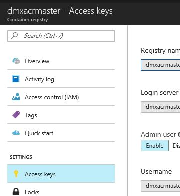

# VSTS to ACI

1. Create a release definition in VSTS. Its pretty similar to setting up a build definition but it looks slightly different. Choose the empty template.
2.  To deploy a single container to ACI just add one task in the default environment. Use the "+" icon to add it. The task is called "Azure CLI preview". In the pipeline connect your build definition you created earlier.
3. Provide an inline script to run the image on ACI as shown below. Replace the necessary values.
```
az container create --name "INSTANCENAME" --image FULLYQUALIFIEDCONTAINERIMAGE:$(Build.BuildNumber) --resource-group RESOURCEGROUPNAME --registry-login-server SERVERNAME --registry-username USERNAME --registry-password PASSWORD --ip-address public --port 8080
```
4. In real life this might look like
```
az container create --name "acihelloworld" --image dmxacrmaster-microsoft.azurecr.io/acihelloworld:$(Build.BuildNumber) --resource-group tmprg --registry-login-server dmxacrmaster-microsoft.azurecr.io --registry-username dmxacrmasteruser --registry-password XXXXXXXXXXXXX --ip-address public --port 8080
```
5. You can find all values for ACR in Azure Portal.


